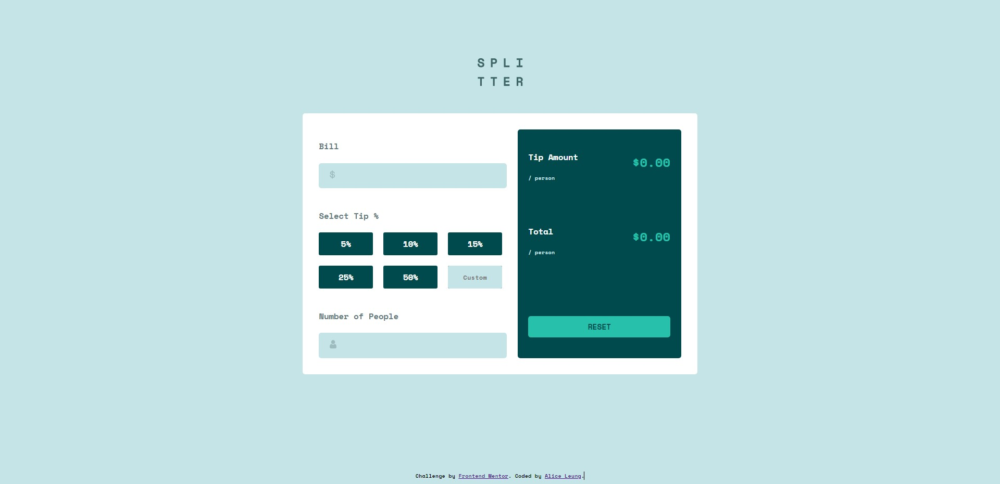

# Frontend Mentor - Tip calculator app solution

This is a solution to the [Tip calculator app challenge on Frontend Mentor](https://www.frontendmentor.io/challenges/tip-calculator-app-ugJNGbJUX). Frontend Mentor challenges help you improve your coding skills by building realistic projects.

## Table of contents

- [Overview](#overview)
  - [The challenge](#the-challenge)
  - [Screenshot](#screenshot)
  - [Links](#links)
- [My process](#my-process)
  - [Built with](#built-with)
  - [What I learned](#what-i-learned)
  - [Continued development](#continued-development)


## Overview

### The challenge

Users should be able to:

- View the optimal layout for the app depending on their device's screen size
- See hover states for all interactive elements on the page
- Calculate the correct tip and total cost of the bill per person

### Screenshot



### Links

- Live Site URL: [https://aleung910.github.io/Splitter---A-Tip-Calculator-App/#]

## My process

### Built with

- Semantic HTML5 markup
- CSS custom properties
- Flexbox
- CSS Grid
- Mobile-first workflow
- JS

### What I learned


```css
.TipPercentage ul{
  list-style:none;
  display:grid;
  grid-template-columns: repeat(3, minmax(0, 10rem));
  grid-gap:20PX;  
  padding:0;
}
```

Learned how to use CSS Grid to create a layout for displaying tip percentages. 
Involves setting up a grid container with three equally spaced columns.

```js
tipOptions.forEach(function (option) {
    option.addEventListener('click', function () {
        tipOptions.forEach(function (opt) {
            opt.classList.remove('selected');
        });
        option.classList.add('selected');
        updateCalculations();
    });
});
```

Made sure that only one option is selected at a time by adding and removing the "selected" class. The "updateCalculations" function is called perform calculations whenever a new tip option is selected.


### Continued development
Want to continue development in:

DOM Manipulation: To dynamically update your webpage based on user interactions.

CSS Grid Layout: I could further explore complex grid structures, responsive design, and more advanced grid features.

CSS Styling and Selectors: Continue to refine my CSS skills, especially in terms of selector specificity, inheritance, and effective use of classes and IDs.


